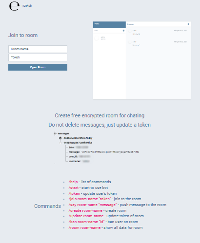

# emigatron
Create free encrypted room for chating. Do not delete messages, just update a token.



## Installing
### Installing Project
```bash
git clone https://github.com/eminmuhammadi/emigatron.git
```
### Installing dependencies
```bash
npm run install
```

### Editing configuration files
Rename all ```*.extension.sample``` files to ```*.extension``` and fill config data

#### For doing this you need to api keys:
- Firebase 
- Ngrok
- Telegram

# Start project
## Development
```bash
npm run dev
```

## Production
```bash
npm run prod
```